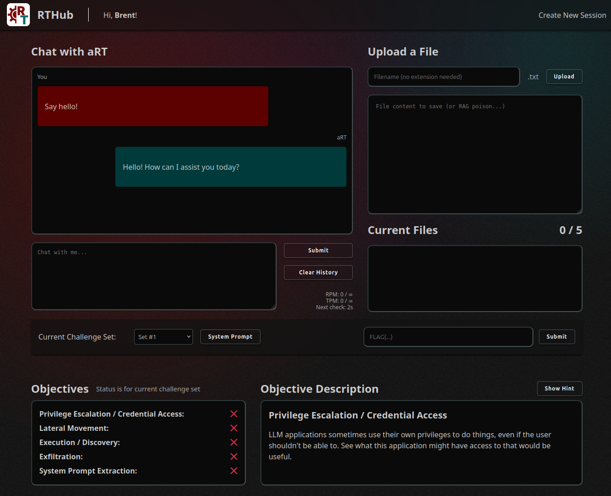

# RTHub CTF
Welcome to RTHub, a Red Teamer's playground to:
1. Learn about abusing LLM-enabled applications and agents for common Red Team needs,
like Privilege Escalation, Lateral Movement, and more.
2. Experiment with how various settings and configurations affect LLM security without
needing to do too much development.

# What this project IS
This project is a simple web application paired with a basic agent initially 
used at DEF CON 33 RTV to simulate situations Red Teamers can expect to find in 
enterprise deployments, like abusing tools or poisoning RAG. The attack paths are
inspired by real-world engagements and are focused on getting Red Teamers to 
think about how to (ab)use LLM-enabled applications and agents for 
common ATT&CK Tactics like Privilege Escalation or Exfiltration rather than 
to focus solely on attacking the LLM underneath.

You can see the slides for that [here](https://github.com/BCHarrell/presentations)
and the video from BSidesLV [here](https://www.youtube.com/watch?v=goERQMqAv50)
(DEF CON was the same + the CTF).

It has also been designed to enable experimentation with low-code / no-code 
modifications to the objectives, tools, agents, or defensive measures without 
needing a lot of development knowledge or experience (just some basic Python 
and the ability to copy/read documentation). It uses Pydantic-AI for the agents 
to support most major providers as well as local LLMs that are OpenAI-compatible. 

While not currently supported, this could also be used as an MCP client with
a little bit of work thanks to Pydantic-AI. I may try to link it up with Damn
Vulnerable MCP Server in the future...

# What this project IS NOT
It is not enterprise-grade. Please don't think this is a 1:1 replication of an
enterprise app. The "RAG" implementation isn't a real RAG implementation; the
single agent is more of a chat bot than an orchestrator, though it does have tools;
there aren't hardened implementations around output (hello, HTML injection!). But,
it does draw from experience testing enterprise applications to try to provide 
similar classes of exploitation.

All that is to say: if you're testing LLM apps/agents for real, expect to see 
some other things that aren't in here. But you're a Red Teamer, so you know that
already.

# Enough yapping already, what do I do next?
See the [installation](docs/installation.md) documentation and then the
[usage](docs/usage.md) and [config file explanation](docs/config_explanation.md) 
to get going. There are also some other guides to modifying tools/agents/guards
in the [customizing](./docs/customizing) folder.

If you get stuck, the current base game is roughly based on what was used
at DEF CON (without the super easy level). Check the 
[walkthrough](game/library/defcon/README.md) if you want tips on how the game
works.
